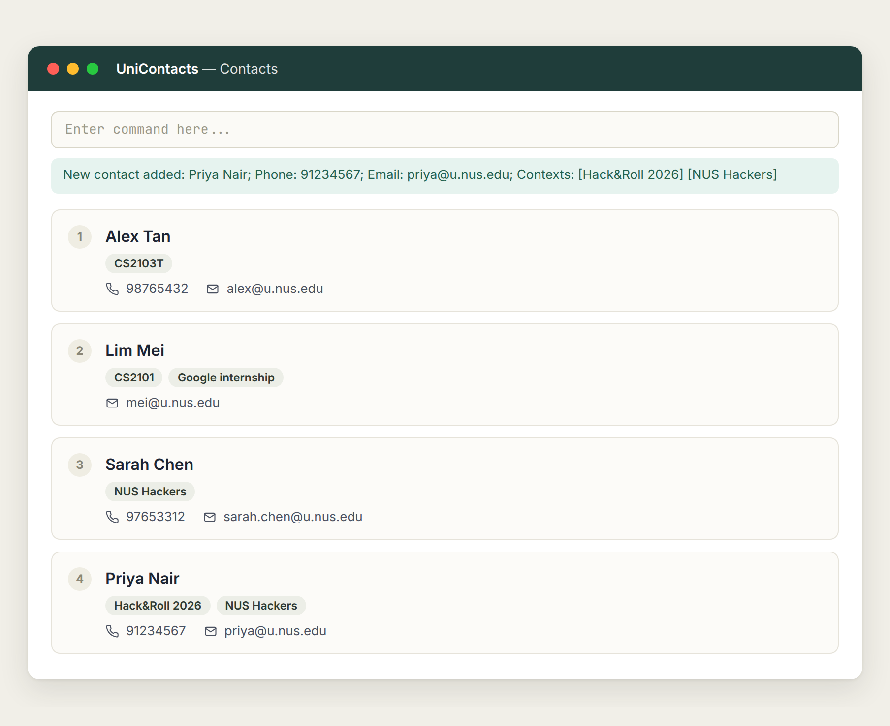

# UniContacts

**UniContacts is a desktop contact manager for university students who meet many people across modules, projects, CCAs, internships and events.**
Every contact is saved with one or more *contexts* describing how you know them (e.g. `CS2103T`, `Hack&Roll 2026`, `Google internship`), so you can find people by where you met them, not just by name.

UniContacts is optimised for fast typists: you work through a command box, while the GUI shows your contacts as cards.

## Features

* Add a contact with a name, at least one context, and an optional phone and email
* List all contacts, with every context shown on each card
* Find contacts by part of their name or context
* Delete a contact by its index in the list
* Save data automatically after every change

## Links

* [User Guide](https://ay2627s1-cs2103t-w10-2.github.io/tp/UserGuide.html)
* [Developer Guide](https://ay2627s1-cs2103t-w10-2.github.io/tp/DeveloperGuide.html)
* [About Us](https://ay2627s1-cs2103t-w10-2.github.io/tp/AboutUs.html)

## Acknowledgements

* This project is based on the AddressBook-Level3 project created by the [SE-EDU initiative](https://se-education.org).
* Libraries used: [JavaFX](https://openjfx.io/), [Jackson](https://github.com/FasterXML/jackson), [JUnit5](https://github.com/junit-team/junit5).
