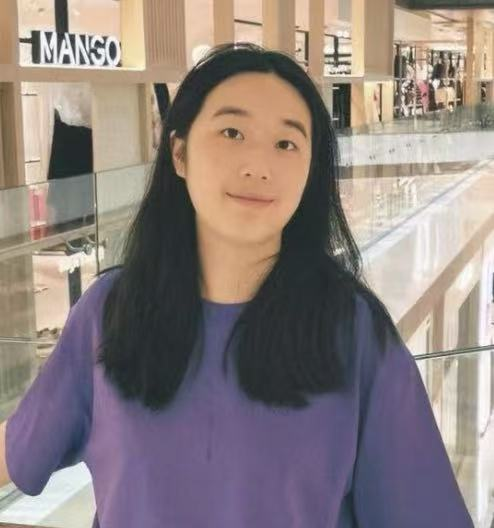
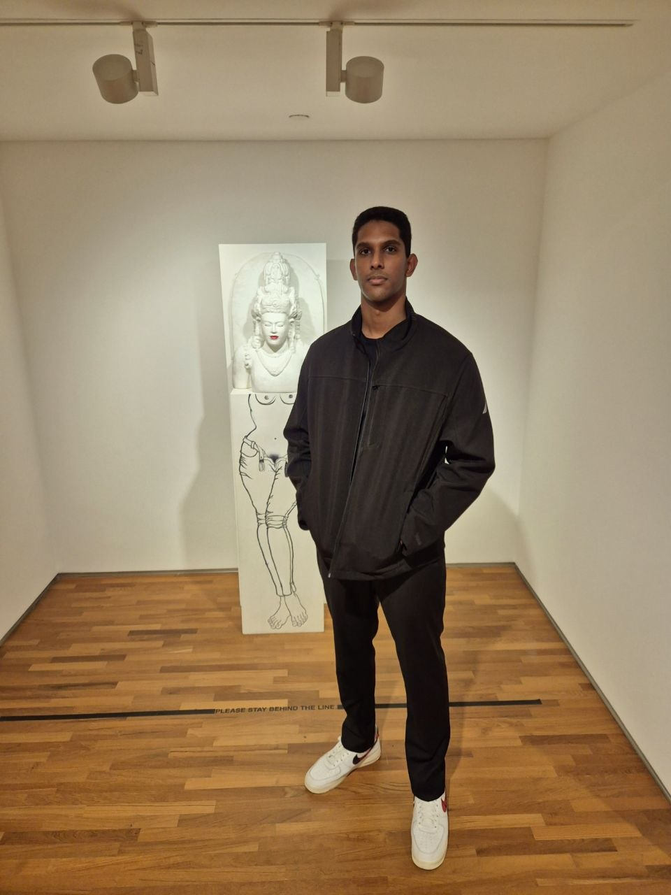
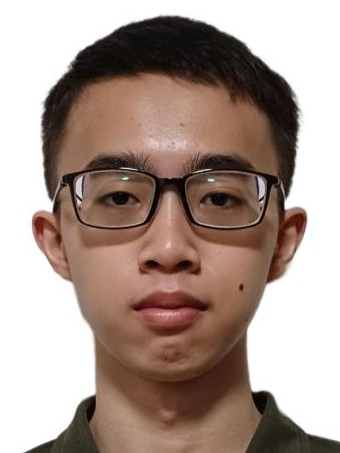

We are a team based in the [School of Computing, National University of Singapore](https://www.comp.nus.edu.sg).

You can reach us at the email `seer[at]comp.nus.edu.sg`

## Project team

### Yang Qirui

[[github](http://github.com/Yukino2711)]

* Role: Developer
* Responsibilities: Requirements, Developer Guide, and testing

### Chen Sixian

[[github](https://github.com/chen-sixian)]

* Role: Developer
* Responsibilities: Feature implementation and testing

### Rajkumar Srivishnu

[[github](https://github.com/vishnuroxx)]

* Role: Developer
* Responsibilities: Backend

### Ryan

[[github](http://github.com/ryan24chua)]

* Role: Developer
* Responsibilities: Dev Ops + Threading

### Tony

[[github](http://github.com/Totonyny511)]

* Role: Developer
* Responsibilities: UI
